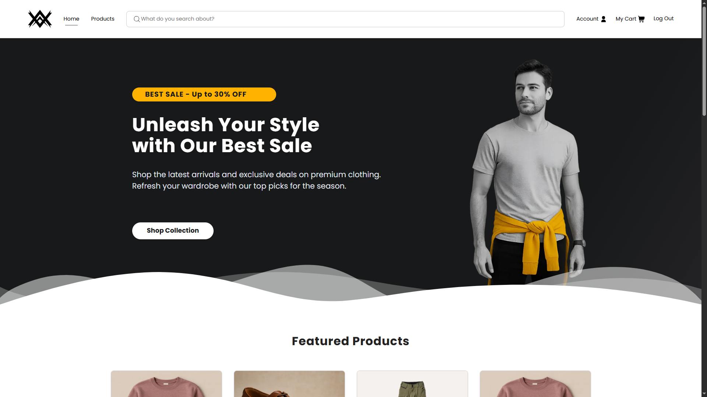
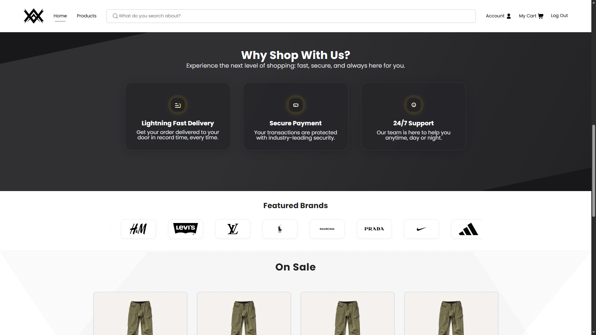
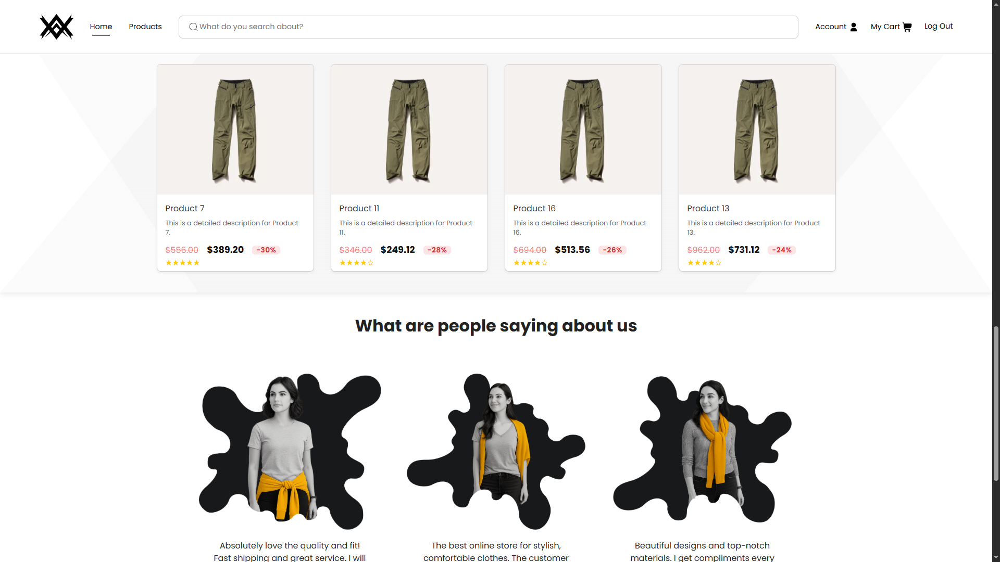
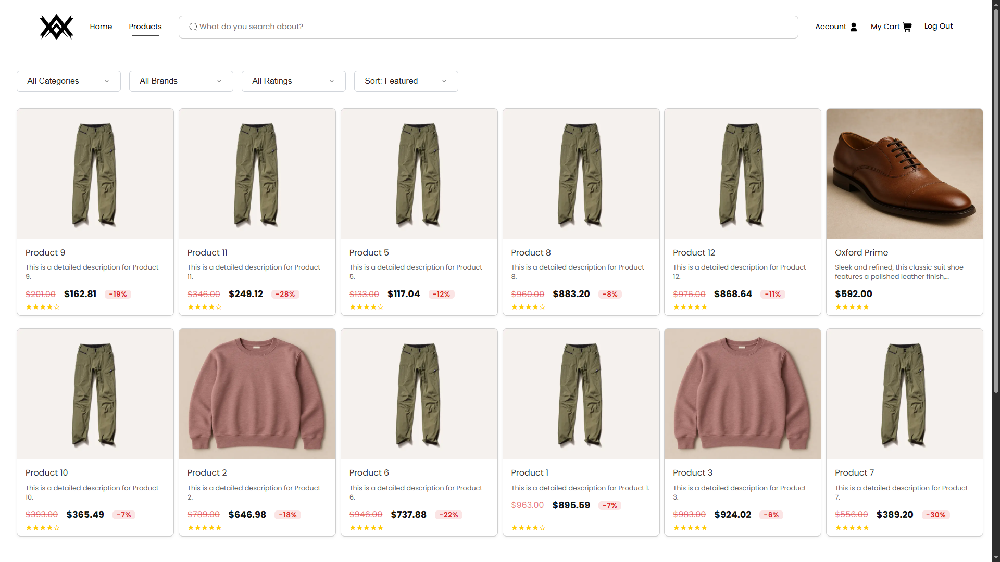
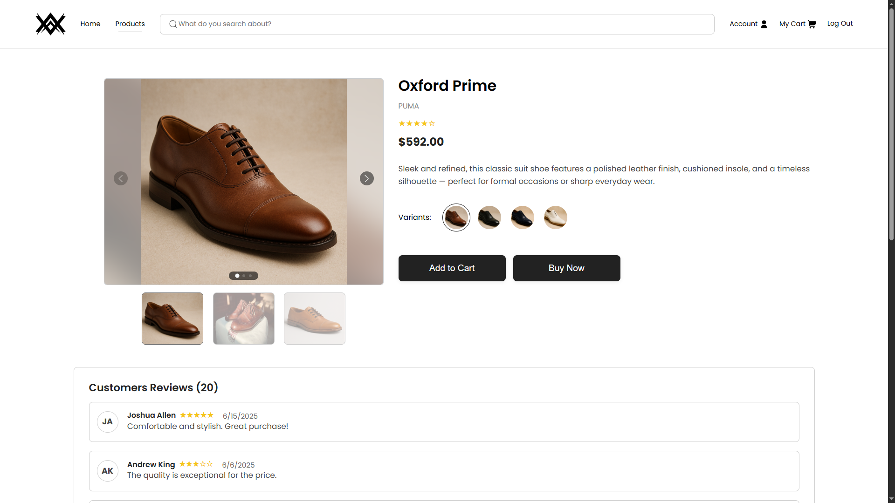
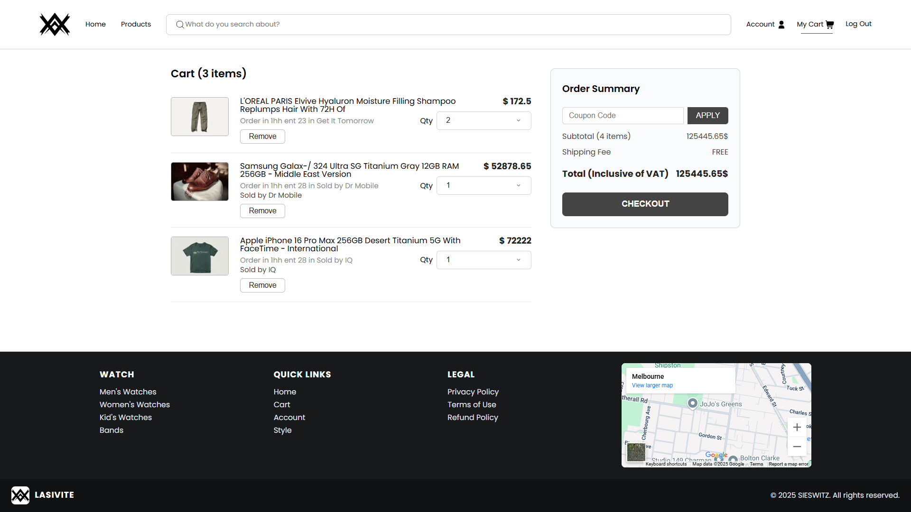

# 🛍️ Walkers

**Walkers** is a comprehensive full-stack e-commerce platform designed for online clothing retail. Built with modern web technologies, it provides a seamless shopping experience with advanced features like dynamic product management, secure checkout, and a powerful admin dashboard for complete business control.

---

## 🌟 Features

- 👤 User Authentication & Account Management
- 🛒 Advanced Shopping Cart with Real-time Updates
- 💳 Secure Checkout with Payment Integration
- 📦 Dynamic Product Listings with Reviews & Ratings
- 🎨 Product Variants & Image Galleries
- 🔍 Advanced Search & Filtering
- 📊 Admin Dashboard with Analytics
- 🏷️ Coupon & Discount Management
- 📈 Order Management & Tracking
- ⭐ User Reviews & Rating System
- 📱 Responsive Design for All Devices

---

## 📁 Project Structure

```
walker/
├── client/                          # Next.js Frontend
│   ├── src/
│   │   ├── app/                     # Next.js 13+ App Router
│   │   │   ├── (adminPages)/        # Admin Dashboard Routes
│   │   │   ├── (authPages)/         # Authentication Pages
│   │   │   ├── (mainPages)/         # Main E-commerce Pages
│   │   │   └── ...
│   │   ├── components/              # Reusable UI Components
│   │   │   ├── admin/               # Admin Dashboard Components
│   │   │   ├── cart/                # Shopping Cart Components
│   │   │   ├── HomePage/            # Homepage Sections
│   │   │   ├── Layouts/             # Layout Components
│   │   │   ├── Products/            # Product-related Components
│   │   │   └── ui/                  # UI Components
│   │   ├── styles/                  # Global Styles & SCSS
│   │   └── utils/                   # Utility Functions
│   ├── public/                      # Static Assets
│   └── ...
│
├── server/                          # Express.js Backend
│   ├── controllers/                 # Route Controllers
│   ├── models/                      # MongoDB Schemas
│   ├── middlewares/                 # Custom Middlewares
│   ├── routes/                      # API Routes
│   ├── uploads/                     # File Uploads
│   ├── utils/                       # Utility Functions
│   ├── redis/                       # Redis Configuration
│   └── server.js                    # Main Server File
│
└── assets/                          # Project Assets & Screenshots
```

---

## 🖼️ Screenshots

<p align="center">
  
</p>
<p align="center">
  
</p>
<p align="center">
  
</p>
<p align="center">
  
</p>
<p align="center">
  
</p>
<p align="center">
  
</p>

---

## 🧰 Tech Stack

### MERN Stack (MongoDB, Express, React, Node.js) + Next.js

- **Frontend:**

  - **Next.js** — React framework with App Router
  - **React** — Component-driven architecture
  - **Sass** — CSS preprocessing

- **Backend:**
  - **Node.js & Express** — Server environment and API routing
  - **MongoDB** — NoSQL document database
  - **Redis** — In-memory cache and session management

---

## 📊 Features Overview

### Customer Features

- **User Registration & Login** — Secure authentication with JWT
- **Product Browsing** — Advanced filtering, search, and categorization
- **Shopping Cart** — Persistent cart with real-time updates
- **Secure Checkout** — Payment integration with order confirmation
- **Product Reviews** — User-generated reviews and ratings
- **Account Management** — Order history and profile management

### Admin Features

- **Dashboard Analytics** — Sales charts and performance metrics
- **Product Management** — Add, edit, and manage inventory
- **Order Management** — Process and track customer orders
- **User Management** — Customer account administration
- **Coupon System** — Create and manage discount codes
- **Content Management** — Update product information and images

---
